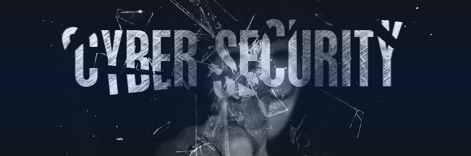

# Leandrys CSEC

Hi, I’m Leandrys, I'm interested in the Cyber-Security world and software development. I'm currently studying at **SkillsforAll academy** and learning about **Networks, Cyber-Threats, Risk Management and Programming Languages**. I have a basic domain of **HTML, CSS, JS, Python** and it will grow soon!. I'd like to collaborate in cybersecurity tools development.

## Where i am?

- [**Linkedin**](https://www.linkedin.com/in/leandrys-csec)
- [**Credly**](https://www.credly.com/users/leandrys-osorio)
